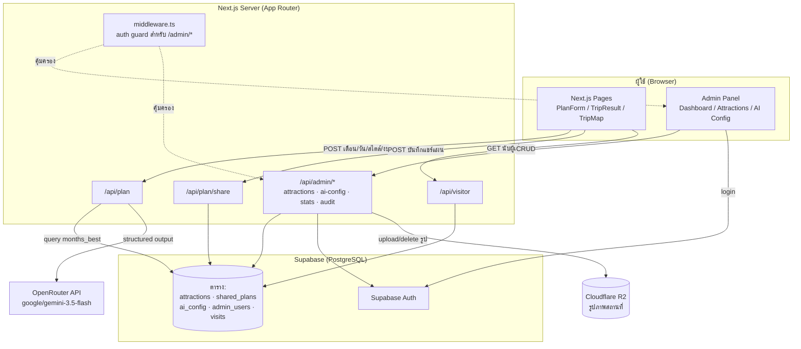
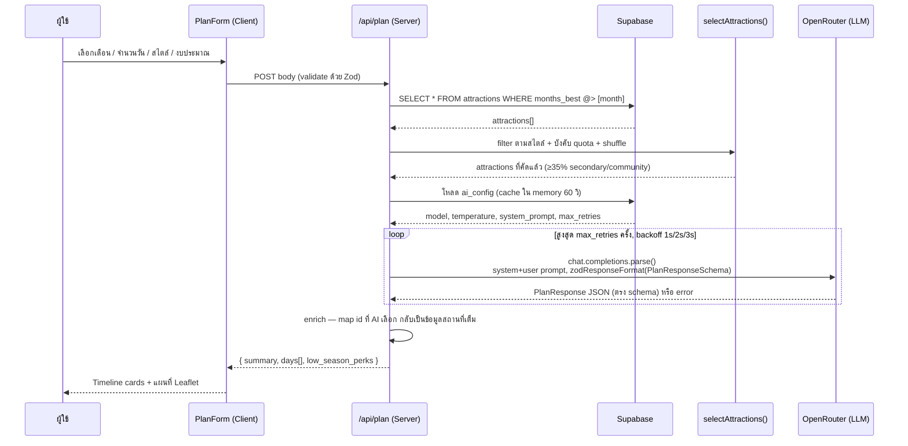

# สรุปการทำงานของ AI และสถาปัตยกรรมแอป — MonNan365

> เอกสารสรุปสั้น พร้อม diagram สำหรับอธิบาย AI trip planner ของ "มนต์น่าน 365"
> รายละเอียดเชิงลึกเพิ่มเติม (schema, component list, deploy pipeline) ดูที่ [00_architecture.mdx](./00_architecture.mdx)

## ภาพรวม

MonNan365 เป็น **RAG-lite AI Trip Planner**: ไม่ให้ LLM คิดสถานที่เอง แต่ query ข้อมูลจริงจาก Supabase มาก่อน กรอง/บังคับสัดส่วนด้วย business logic แล้วค่อยส่งชุดข้อมูลที่คัดแล้วให้ LLM เลือกและอธิบายเหตุผลเท่านั้น — ป้องกัน hallucination และรับประกันว่าทุกแผนมีแหล่งท่องเที่ยวรอง/ชุมชนอย่างน้อย 35%

## Diagram: สถาปัตยกรรมแอปทั้งระบบ

## การทำงานของ AI (Trip Planning Flow)

จุดเริ่มต้นที่ `src/app/api/plan/route.ts`:

### รายละเอียดแต่ละขั้นตอน

1. **Validate request** — `PlanRequestSchema` (Zod) ตรวจ `month` (1-12), `days` (1-5), `styles` (nature/culture/food/wellness/community อย่างน้อย 1), `budget`
2. **Query ฐานข้อมูล** — ดึงเฉพาะ attractions ที่ `months_best` ครอบคลุมเดือนที่เลือก (`.contains("months_best", [month])`)
3. **`selectAttractions()`** (`src/lib/selectAttractions.ts`) — กรองตามสไตล์ (fallback เป็นทั้งหมดถ้า pool เล็กเกินไป) → แยก pool หลัก/รอง → สุ่มด้วย Fisher-Yates ทั้งสอง pool → บังคับสัดส่วนรอง/ชุมชนขั้นต่ำ 35% ของ target (`min(pool.length, max(days×4, 12))`) → รวมและสุ่มอีกครั้ง
4. **โหลด AI config** — พารามิเตอร์ LLM (model, temperature, max_tokens, max_retries, system prompt) มาจากตาราง `ai_config` ที่แก้ได้ผ่าน admin panel, cache ใน memory 60 วินาทีเพื่อลด DB hit
5. **เรียก LLM ผ่าน OpenRouter** — ใช้ `zodResponseFormat(PlanResponseSchema, "plan")` บังคับ schema ระดับ API พร้อม system prompt ภาษาไทยที่กำหนดกติกา anti-hallucination (ใช้เฉพาะ id ในรายการที่ส่งไป, ทุกวันต้องมีแหล่งรอง/ชุมชนอย่างน้อย 1 แห่ง) — retry สูงสุด `max_retries` ครั้งต่อ model ด้วย exponential backoff
6. **Enrich** — จับคู่ `id` ที่ AI เลือกกลับเป็นข้อมูลสถานที่เต็มจาก `selected` (ไม่ใช่ query DB ซ้ำ) แล้วส่งกลับเป็น `PlanApiResponse`

## กลไกสำคัญ (Design Decisions)

| กลไก | รายละเอียด |
|---|---|
| **35% Secondary/Community Quota** | บังคับใน `selectAttractions()` ก่อนส่งเข้า LLM ไม่ใช่แค่ prompt engineering — วัดผลได้ 100% ของ output |
| **Anti-hallucination** | LLM เลือกได้เฉพาะ `id` จาก dataset ที่ส่งไปเท่านั้น ห้ามแต่งสถานที่ |
| **Structured Output** | `zodResponseFormat` บังคับ JSON schema ระดับ API ไม่ต้อง parse/validate เอง |
| **Retry + Backoff** | สูงสุด 3 ครั้ง (ปรับได้), หน่วง 1s → 2s → 3s ต่อ attempt |
| **AI Config Cache** | 60 วินาที ต่อ server instance ลด DB round-trip ทุก request |
| **RLS แยกสิทธิ์** | Client/SSR ใช้ publishable key (อ่านอย่างเดียว), เขียนได้เฉพาะผ่าน service role key ฝั่ง server |

## Tech Stack

| Layer | เทคโนโลยี |
|---|---|
| Framework | Next.js 16 (App Router, standalone output) |
| UI | React 19 + Tailwind CSS 4 |
| Database | Supabase (PostgreSQL, RLS) |
| LLM | OpenRouter → `google/gemini-3.5-flash` |
| Validation | Zod + Structured Outputs |
| แผนที่ | Leaflet + OpenStreetMap |
| Storage | Cloudflare R2 (รูปสถานที่) |
| Auth | Supabase Auth (email/password) |
| Deploy | Docker multi-stage → VPS (GitHub Actions CI/CD) |
